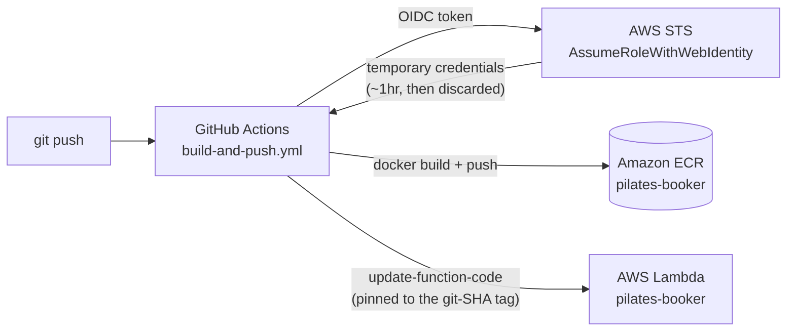
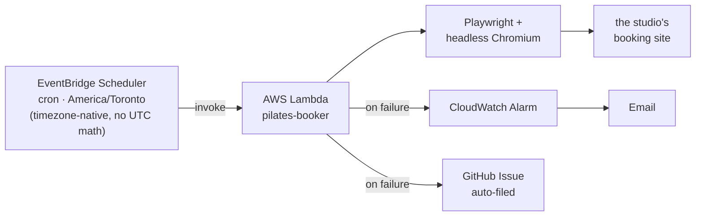

# Pilates Booker

A serverless bot that wins a race no human can: a Pilates studio releases each
Saturday class every Thursday at 11:00:00 a.m. sharp, and the popular slot
fills in **about a minute**. This project logs in, waits for the exact
release moment, and books the class automatically — running unattended on
AWS, redeploying itself on every code change, and reporting its own failures.

Built as a real personal tool (this books my own studio's classes every
week), and written up here as a small case study in taking something from
"a Python script on my laptop" to a self-healing, self-deploying cloud
service — including every bug hit along the way.

## Contents

- [Architecture](#architecture)
- [Design decisions](#design-decisions--why-its-built-this-way)
- [The debugging journey](#the-debugging-journey)
- [Repository layout](#repository-layout)
- [Running it](#running-it)
- [Cost](#cost)

## Architecture

Two independent pipelines share one artifact: a container image holding the
booking script, Python, and a full headless Chromium.

**1. CI/CD — every push to `main` rebuilds and redeploys**



No AWS access key is stored anywhere. GitHub's OIDC token proves "this is
really a run of this repo" to AWS, which hands back credentials valid for
about an hour — used once, then gone.

**2. Runtime — fires every Thursday, independent of the pipeline above**



Two schedules fire three minutes apart (10:55 and 10:58 a.m.) as a primary
and a backup — the second one checks the account's existing bookings before
doing anything, so if the primary already succeeded, it just exits.

## Design decisions — why it's built this way

Every choice here came from hitting a real constraint, not from following a
tutorial:

- **Container image, not a zip + layer.** Lambda's zip deployment caps out
  at 250MB unzipped. A full Chromium plus every shared library it needs
  blows past that instantly for Python specifically (Node has mature
  slim-Chromium layers; Python doesn't). A container image (10GB limit)
  is the only realistic path.

- **EventBridge Scheduler, not GitHub Actions cron.** The first version ran
  entirely on GitHub Actions. Its free-tier scheduler is best-effort and,
  in production, fired **60–90 minutes late** — worthless for a class that
  fills in a minute. EventBridge Scheduler is a real managed cron with
  native timezone support (handles daylight saving with zero code), which
  is the actual reason this moved to AWS at all.

- **Pinned image digests, not `:latest`.** The CI/CD pipeline deploys Lambda
  to the exact git-commit-SHA image tag, never the mutable `latest` tag —
  there's never ambiguity about which code is actually running.

- **Fails safe on money.** The booking flow only ever spends an existing
  class-package credit. If the only option on the payment screen is "buy a
  new plan," the script stops and does nothing — it will never make an
  unattended purchase.

- **Double-booking guard.** The studio's own site will happily let you book
  the same class twice (and burn two credits). Before ever selecting a
  date, the script checks the account's existing bookings and skips
  anything already reserved.

- **The failure loop is part of the design, not an afterthought.** A
  CloudWatch Alarm emails on any unhandled error, and the Lambda function
  itself auto-files a GitHub Issue with the traceback and a CloudWatch Logs
  pointer — so a failure is actionable within minutes, not discovered a
  week later when the class silently didn't get booked.

## The debugging journey

Getting a full browser to run inside AWS Lambda's stripped-down container
surfaced four distinct, non-obvious failures — each a small case study in
its own right:

| Symptom | Root cause | Fix |
|---|---|---|
| `ImportModuleError: No module named 'playwright'` | The base image's Playwright package wasn't reliably importable from wherever Lambda's runtime actually executes Python | Pin `playwright` explicitly in the image's own requirements file |
| `ZoneInfoNotFoundError: 'America/Toronto'` | The minimal container ships no IANA timezone database at the OS level | Add the pure-Python `tzdata` package as a fallback |
| `Browser.new_page: Target crashed` | Lambda's container can't support Chromium's normal multi-process architecture | Launch with `--single-process --no-zygote`, plus `HOME=/tmp` — the only writable path in the container — for Chromium's profile |
| Login modal never appeared, despite the page loading correctly | Lambda's slower single-process Chromium hadn't finished hydrating the site's JS widget when the script clicked "Log in" | Replaced fixed sleeps with waits on actual page content, retried for up to 90s |

Each was diagnosed from CloudWatch Logs alone (the script logs the page URL,
title, and visible text on any failure) — no local reproduction of the
Lambda environment was needed.

## Repository layout

```
pilates-booker/
├── book_class.py                     # Core automation: login, poll for the release, book
├── lambda_handler.py                 # Lambda entrypoint; auto-files a GitHub Issue on failure
├── Dockerfile                        # Playwright's own image + AWS Lambda Runtime Interface Client
├── requirements-lambda.txt           # Deps baked into the container image
├── requirements.txt                  # Deps for local runs
├── .dockerignore
├── .env.example                      # Local credential template (never committed)
└── .github/workflows/
    ├── build-and-push.yml            # CI/CD: build → push to ECR → deploy to Lambda
    └── book-pilates.yml              # Retired GitHub-Actions-cron approach; kept as a manual fallback
```

## Running it

**Locally, for development:**

```bash
python3 -m venv .venv && source .venv/bin/activate
pip install -r requirements.txt && playwright install chromium
cp .env.example .env   # fill in your own credentials
set -a; source .env; set +a
DRY_RUN=true WAIT_FOR_RELEASE=false python book_class.py
```

`DRY_RUN=true` runs the entire flow — login, slot detection, waiver, package
selection — and stops just before the final booking click.

**In production:** push to `main`. The GitHub Actions workflow builds the
image, pushes it to ECR, and redeploys the Lambda function automatically;
EventBridge Scheduler handles the rest. See `book_class.py`'s module
docstring for the full list of configuration environment variables.

## Cost

Everything here fits AWS's Always-Free tier:

| Service | Usage | Cost |
|---|---|---|
| Lambda | ~10 invocations/month, a few GB-seconds each | $0 (well under the 400,000 GB-s free tier) |
| EventBridge Scheduler | ~10 invocations/month | $0 (rounds to nothing at $1/million) |
| CloudWatch Logs + Alarm | a few KB/week, 1 alarm | $0 (under the 5GB / 10-alarm free tiers) |
| ECR image storage | ~1.5GB, lifecycle-capped at 10 images | a few cents/month |

Total: effectively free to run indefinitely.
